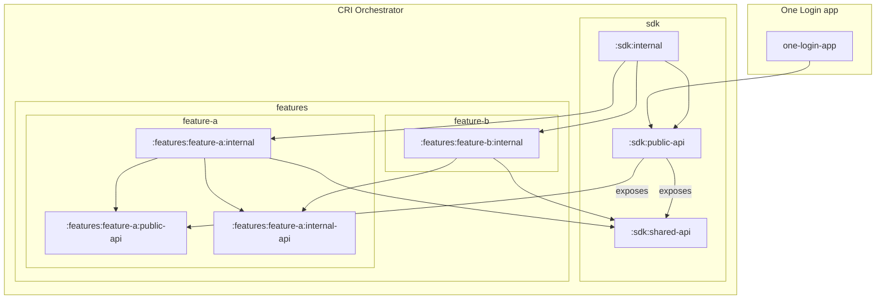

# Architecture

## Gradle modules

Gradle modules are separated into several categories:
- Main library modules
  - `library:public-api` - the public API visible to the host app.
  - `library:shared-api` - public API shared between the host app and library modules.
  - `library:internal` - depends on every module in the library to build the dependency graph.
- Feature modules
  - `features:<feature-name>:public-api` - public API (interfaces) for features of the library, visible to the host app.
  - `features:<feature-name>:internal-api` - shared contract within the SDK, for example the navigation graph that a feature hosts.
  - `features:<feature-name>:internal` - implementations for features.
- Library modules
  - `libraries:<library-name>` - low level utilities that do not have many dependencies.

### Visibility
Avoid exposing implementation details that could be kept internal.
- If it is not possible to apply the `internal` visibility modifier to an internal implementation, create a separate module to hold these internal feature implementations. This way there are two modules, one to expose the public API and one for the private implementation.
- Do not split API/implementation if it is not necessary. For example, a simple library module that exposes only utility functions may fall into this category.

## Dependencies between modules

This diagram shows key dependencies between modules.

Note that not all modules and dependencies are displayed.

